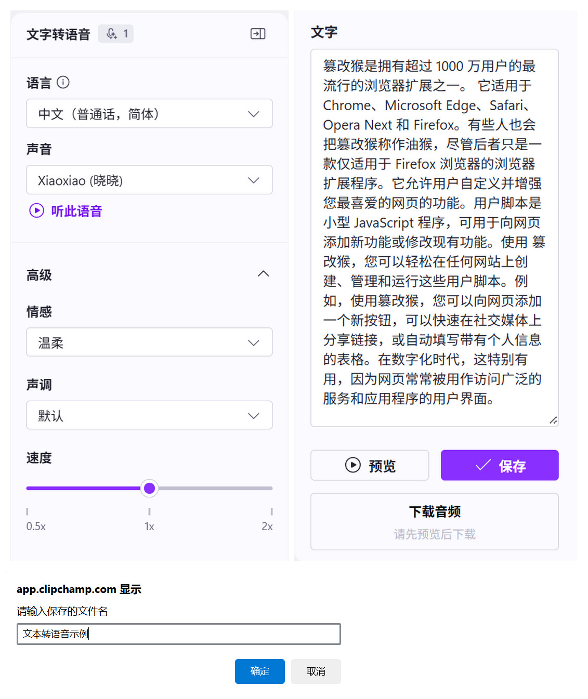

# clipchamp-tts-download

> 为 Clipchamp 文本转语音面板增加音频下载按钮

## 效果展示

## 使用方法

1. [安装油猴拓展](https://www.tampermonkey.net/)
2. [安装脚本](https://greasyfork.org/zh-CN/scripts/538156-clipchamp-tts-download)
3. 打开 Clipchamp 文本转语音面板，输入需要转换的文字，点击预览按钮，然后点击下载按钮即可下载音频文件。

## 实现原理

1. **劫持 `Blob` 构造函数**：

   * 自定义一个 `NewBlob` 类继承自原生 `Blob`，在构造时使用 `URL.createObjectURL(this)` 获取音频资源的 Blob URL。
   * 将该 URL 存入响应式状态 `currentBlobURL.val`，供后续下载使用。
   * 通过 `window.Blob = NewBlob` 全局替换原生 `Blob` 构造函数，从而捕捉 Clipchamp 在页面中创建的音频 Blob 对象。

2. **使用 `MutationObserver` 检测 UI 面板加载**：

   * 当包含 `.isPropertyPanel` 的面板被添加到 DOM 中，脚本会检查是否存在音频输入框与下载按钮。
   * 如果按钮尚未添加，脚本通过 `vanjs-core` 渲染一个按钮并插入 UI。

3. **构建下载按钮并控制状态**：

   * 下载按钮根据 `inputValue` 和 `currentBlobURL` 的有效性动态切换颜色和鼠标指针样式（启用或禁用）。
   * 点击按钮时弹出 `prompt` 询问保存文件名，若用户确认，则创建 `<a download>` 链接并模拟点击，下载音频文件（以 `.mp3` 为扩展名）。
